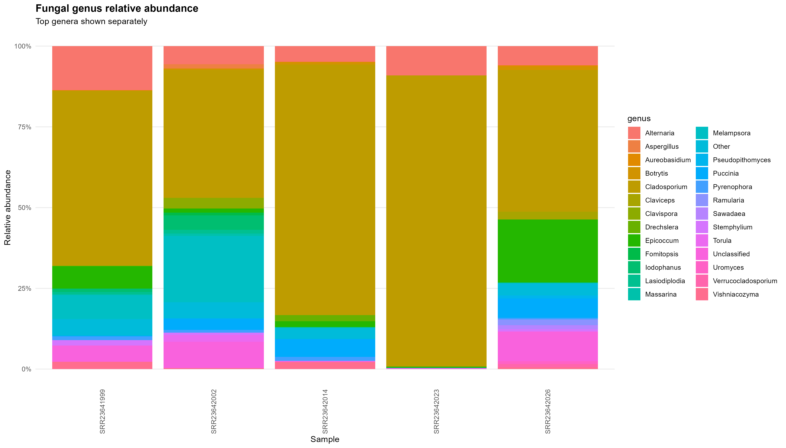
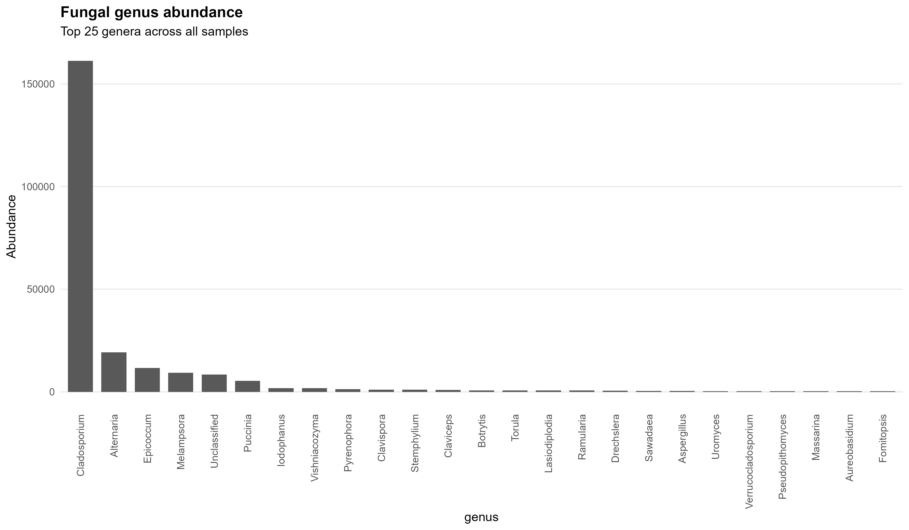
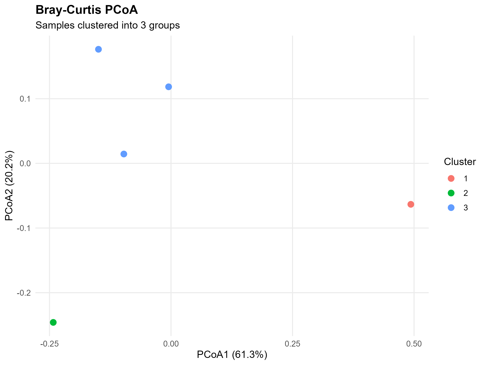

# Metabarcoding Workbench

A complete, end-to-end bioinformatics pipeline for fungal ITS metabarcoding analysis. This workflow covers data acquisition from ENA/SRA, quality filtering and denoising with DADA2, taxonomic classification with `dnabarcoder`, and statistical downstream visualization in R.

------------------------------------------------------------------------

### Repository Setup & Cloning

To get started with the pipeline on your local machine, clone the repository and navigate into the project directory:

```powershell
# Clone the repository
git clone [https://github.com/Theofili/metabarcoding-workbench.git](https://github.com/Theofili/metabarcoding-workbench.git)

# Navigate into the project folder
cd metabarcoding-workbench
```

## Workflow Overview & Pipeline Execution

### Environment Setup & Tool Verification

Before running the analysis, initialize the virtual environment and ensure all Python, R, and BLAST dependencies are properly linked and recognized:

``` powershell
# Set execution policy and activate the virtual environment
Set-ExecutionPolicy -Scope Process -ExecutionPolicy RemoteSigned
.\.venv\Scripts\Activate.ps1

# Verify Python, R, and BLAST executables
py --version
$env:Path += ";C:\Program Files\R\R-4.4.1\bin"
Rscript --version

$env:Path += ";C:\Users\theos\Downloads\ncbi-blast-2.17.0+-x64-win64\ncbi-blast-2.17.0+\bin"
blastn -version

# Run dependency check scripts
python scripts/00_check_setup.py
Rscript -e "library(ggplot2); library(vegan); library(dada2); library(ShortRead); cat('All required R packages loaded successfully.\n')"
```

### Step 1: Downloading Raw FastQ Data

Query the European Nucleotide Archive (ENA) for BioProjcet `e.g PRJNA934949` and download raw paired-end FASTQ reads (limited to 5 test samples):

``` powershell
python scripts/01_download.py PRJNA934949 --limit 5
```

- **Output:** FASTQ files stored in `data/fastq/` and download manifest saved to `results/s`

  ### Step 2: Quality Filtering & Denoising (DADA2)

Run DADA2 to assess read intergrity, filter low-quality sequences, learn error rates, merge forward/reverse pairs, remove chimeras, and generate Amplicon Sequence Variants (ASVs):

``` powershell
Rscript scripts/02_dada2.R
```

- **Outputs:**

  - `results/seqtab_nochim.rds` & `results/asv_table.tsv` (ASV abundance matrix)

  - `dnabarcoder_input/asvs.fasta` (Fasta file of inferred ASV sequences)

  - `results/read_tracking.tsv` & `results/fastq_integrity_report.tsv`

### Step 3: Taxonomic Assignment (`dnabarcoder`)

Performs BLAST searches of ASVs against the UNITE 2025 ITS database and assign taxonomy using local cutoff thresholds:

``` powershell
python scripts/03_taxonomy.py
```

- **Outputs:** `results/dnabarcoder/asvs.unite2025ITS2_BLAST.classified`

### Step 4: Downstram Visualization & Analysis

Parse classification output to summarize taxonomic composition, compute relative abundances, and generate Bray-Curtis PCoA community ordination plots across different taxonomic ranks:

``` powershell
# Analyze Family rank for ITS2 region
Rscript scripts/04a_visualization.R --region its2 --rank genus
```

- **Outputs:**

  - Abundance bar plots & PCoA plots in `results/plots/`

  - Exported rank matrices: `results/taxonomy_table_family_its2.tsv`, `results/taxonomy_table_class_its2.tsv`

### Repository Structure

``` text
metabarcoding-workbench/
├── R/                  # R helper configurations
├── scripts/            # Workflow execution scripts
│   ├── 00_check_setup.py
│   ├── 01_download.py
│   ├── 02_dada2.R
│   ├── 03_taxonomy.py
│   ├── 04_visualization.R
│   └── 04a_visualization.R
├── results/            # Run outputs (ASV tables, taxonomy mapping, plots)
│   └── plots/          # PNG visualizations
├── dnabarcoder_input/  # Processed fasta inputs
├── .gitignore          # Excludes raw data, virtualenv, and temp files
└── requirements.txt    # Python dependencies
```

## Output Visualizations

### 1. Relative Abundance



### 2. Total Abundance



### 3. Bray-Curtis PCoA Clustering

